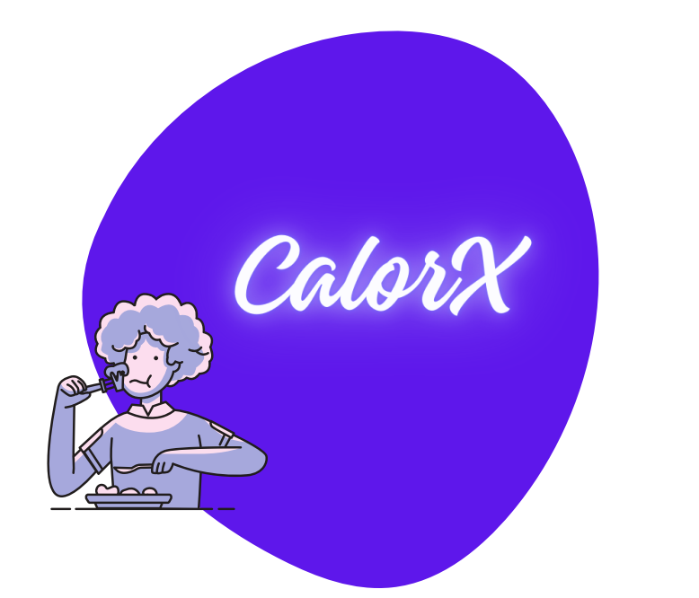
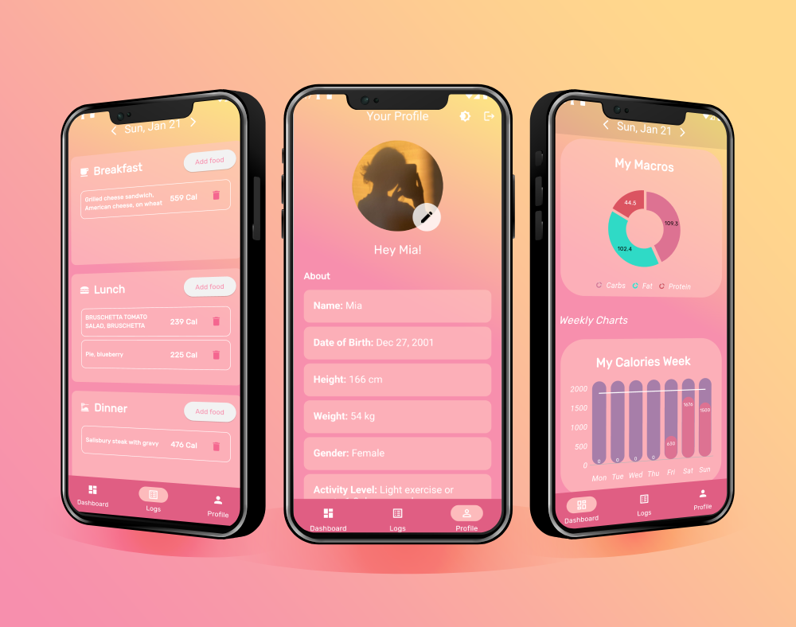
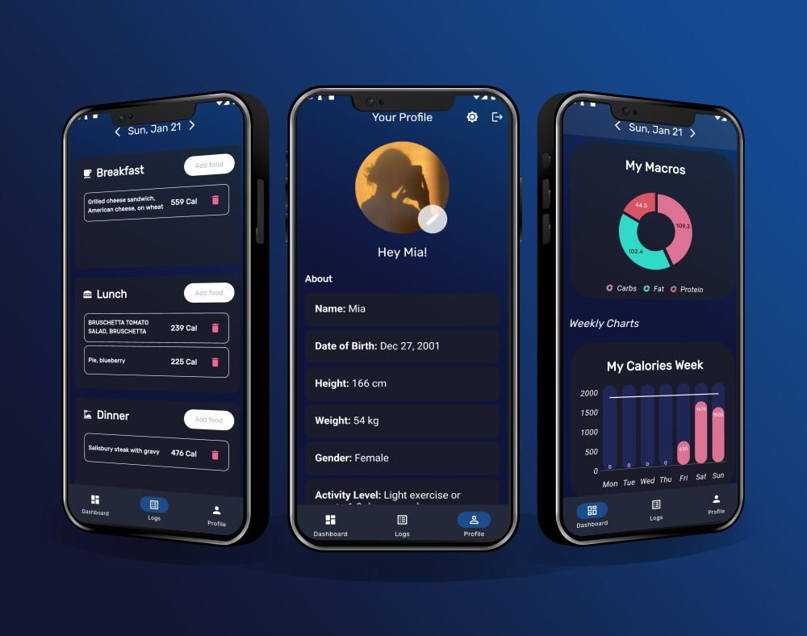

<!-- PROJECT LOGO -->
<br />
<div align="center">
  <a href="https://github.com/MiaN11579/CalorX">
    
  </a>

<h3 align="center">CalorX</h3>

  <p align="center">
    A user-friendly calorie tracking app that efficiently and easily logs meals using the USDA food database. Tracks daily and weekly calorie intake, and visualizes your progress throughout each week.
    <br />
    <a href="https://github.com/MiaN11579/CalorX/issues">Report Bug</a>
    ·
    <a href="https://github.com/MiaN11579/CalorX/issues">Request Feature</a>
  </p>
</div>


<!-- TABLE OF CONTENTS -->
<details>
  <summary>Table of Contents</summary>
  <ol>
    <li>
      <a href="#about-the-project">About The Project</a>
      <ul>
        <li><a href="#screenshots">Screenshots</a></li>
        <li><a href="#built-with">Built With</a></li>
        <li><a href="#features">Features</a></li>
      </ul>
    </li>
    <li><a href="#installation">Installation</a></li>
    <li><a href="#contributing">Contributing</a></li>
    <li><a href="#license">License</a></li>
    <li><a href="#contact">Contact</a></li>
  </ol>
</details>


<!-- ABOUT THE PROJECT -->
# About The Project

### Have a look at the <a href="https://www.youtube.com/watch?v=549-b2WlWQA"> app showcase </a>!

## Screenshots





### Built With


   
 


## Features

 * Dashboard
   * Display visual charts for daily and weekly calorie intake, as well as macronutrient ratio.
   * Allow users to track their progress over time and identify trends in their dietary habits.
 * Logs
   * Enable users to search for food using the USDA database and adjust the input amount.
   * Keep daily food logs organized in separate meal sections for easy reference and analysis.
 * Profile
   * Allow users to add and update avatar photo from their camera or gallery.
   * Display personal health data, such as weight, height, and fitness goals, and provide the ability to update this information as needed.


## Installation

**Step 1:**

[Setup Flutter](https://flutter.dev/docs/get-started/install)

**Step 2:**


Download or clone this repo by using the link below:

```
https://github.com/MiaN11579/CalorX.git
```

**Step 3:**

Go to the project root and execute the following command in the console to get the required dependencies: 

```
flutter pub get 
```
**Step 4:**

Setup the Firebase:

1. You'll need to create a Firebase instance. Follow the instructions at https://console.firebase.google.com.
2. Once your Firebase instance is created, you'll need to enable Google authentication.

* Go to the Firebase Console for your new instance.
* Click "Authentication" in the left-hand menu.
* Click the "sign-in method" tab.
* Click "Google" and enable it.

3. Enable the Firebase Database
* Go to the Firebase Console.
* Click "Database" in the left-hand menu.
* Click the Cloudstore "Create Database" button.
* Select "Start in test mode" and "Enable".

4. (skip if not running on Android)

* Create an app within your Firebase instance for Android, with your app package name.
* Run the following command to get your SHA-1 key:

```
keytool -exportcert -list -v \
-alias androiddebugkey -keystore ~/.android/debug.keystore
```

* In the Firebase console, in the settings of your Android app, add your SHA-1 key by clicking "Add Fingerprint".
* Follow instructions to download google-services.json.
* Place `google-services.json` into `/android/app/`.

6. (skip if not running on iOS)

* Create an app within your Firebase instance for iOS, with your app package name.
* Follow instructions to download GoogleService-Info.plist
* Open XCode, right-click the Runner folder, select the "Add Files to 'Runner'" menu, and select the GoogleService-Info.plist file to add it to /ios/Runner in XCode.
* Open /ios/Runner/Info.plist in a text editor. Locate the CFBundleURLSchemes key. The second item in the array value of this key is specific to the Firebase instance. Replace it with the value for REVERSED_CLIENT_ID from GoogleService-Info.plist.

Double check install instructions for both
   - Google Auth Plugin
     - https://pub.dartlang.org/packages/firebase_auth
   - Firestore Plugin
     -  https://pub.dartlang.org/packages/cloud_firestore


<!-- CONTRIBUTING -->
# Contributing

Contributions are what make the open-source community such an amazing place to learn, inspire, and create. Any contributions you make are **greatly appreciated**.

If you have a suggestion to improve this, please fork the repo and create a pull request. You can also open an issue with the tag "enhancement".
Don't forget to give the project a star! Thanks again!

1. Fork the Project
2. Create your Feature Branch (`git checkout -b feature/AmazingFeature`)
3. Commit your Changes (`git commit -m 'Add some AmazingFeature'`)
4. Push to the Branch (`git push origin feature/AmazingFeature`)
5. Open a Pull Request


<!-- LICENSE -->
# License

Distributed under the MIT License. See `LICENSE` for more information.


<!-- CONTACT -->
# Contact

Feel free to reach out to me if you have any questions!

Mia Nguyen - [LinkedIn](https://www.linkedin.com/in/mia-n-880538174/) - quynhnhu11579@gmail.com

Project Link: [https://github.com/MiaN11579/CalorX](https://github.com/MiaN11579/CalorX)
